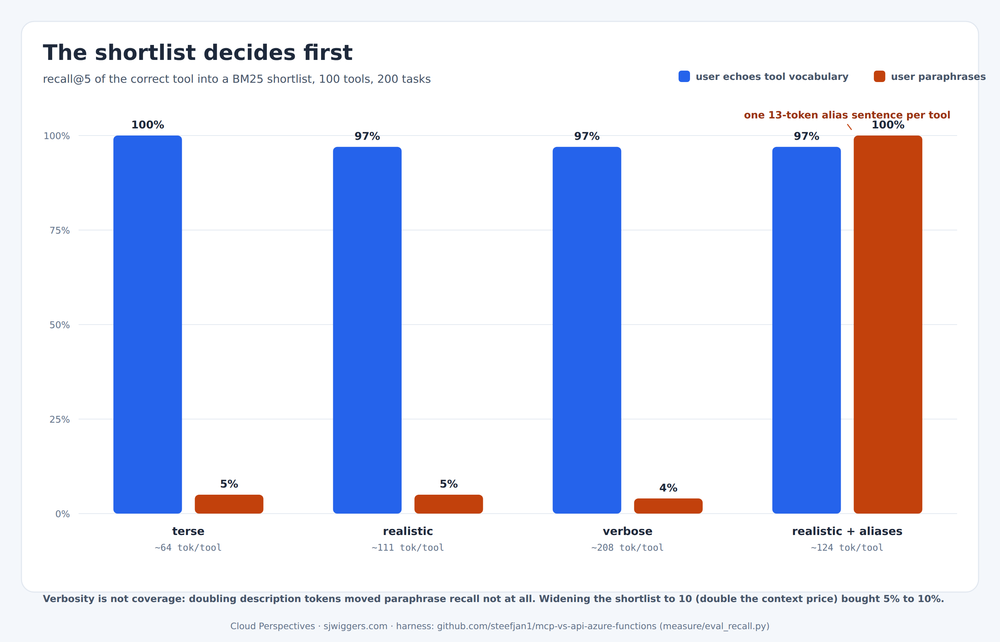

# The Shortlist Decides First

The eval this post runs was designed by the readers. A commenter on [What the Agent Pays for Discovery](https://dev.to/steefjan_wiggers_34a415b/what-the-agent-pays-for-discovery-221a) reframed tool selection as a two-stage system: first recall, whether the correct tool makes it into the shortlist that deferred loading or retrieval produces, then selection, whether the model chooses it from that shortlist. He added the design constraint that stuck with me: a cheap context with the right tool absent is the worst outcome, because it fails silently. The model does not error; it improvises with what it has.

That splits the eval into two experiments with very different price tags. Stage two needs a live model, many runs, and scripted tasks. Stage one needs no model at all. Deferred tool loading in practice means retrieving candidate tools by matching the user's request against tool names and descriptions, and retrieval quality is a property of the descriptions. That is measurable deterministically, so this post measures it. The harness lives in the [companion repo](https://github.com/steefjan1/mcp-vs-api-azure-functions) under `measure/`, next to the token counter from the discovery post.

## The setup

The tool pool is the same deterministic set of one hundred synthetic enterprise tools from the discovery post (search_invoice, approve_claim, and so on), at the same three description levels: terse, realistic, verbose. Retrieval is BM25 over each tool's serialized definition, name, description, and parameter descriptions, with a shortlist of five, which is the curated-manifest size from the break-even discussion.

The tasks are the interesting part. Two hundred of them, one pair per tool, in two kinds. Vocabulary tasks echo the tool's own domain words: "Please approve the claim CLM-2041." Paraphrase tasks say the same thing the way a person who never read your API docs would: "Can you sign off on that damage report, number CLM-2041?" Same intent, same identifier, not one shared content word.

## The numbers

Recall at five, one hundred tools, two hundred tasks:

| Descriptions | Vocabulary | Paraphrase |
|---|---|---|
| Terse | 100% | 5% |
| Realistic | 97% | 5% |
| Verbose | 97% | 4% |

Two findings, one comfortable and one not. When the user speaks the tool's vocabulary, retrieval is essentially solved; even terse descriptions score perfectly, because the tool name alone carries the match. When the user paraphrases, recall collapses to five percent, and here is the uncomfortable part: verbosity does nothing. The verbose tier costs 208 tokens per tool, roughly double realistic, and its recall is statistically identical. All those extra words are the same words repeated. More prose is not more retrieval surface if it keeps drawing from the same vocabulary.

Which exposes the assumption hiding inside "just defer tool loading and retrieve on demand." Retrieval only sees what the description says. Your users say "bill", "delivery", "sign off". Your descriptions say "invoice", "shipment", "approve". Between those two vocabularies sits a 95 percent silent failure rate, and the failure mode is exactly the one the commenter flagged: the shortlist arrives cheap, plausible, and wrong, and the model does its best with it.

## Can a longer shortlist buy it back?

The obvious counter is to widen the shortlist, so I swept it. The shortlist size is also a context budget, priced with the tokenizer from the discovery post: five realistic tools cost about 542 tokens per model call, ten cost 1,040.

| Shortlist | Tokens per call | Paraphrase recall (realistic) |
|---|---|---|
| 3 | ~362 | 3% |
| 5 | ~542 | 5% |
| 10 | ~1,040 | 10% |

Doubling the price buys recall from five percent to ten. That is not a fix, that is a linear crawl toward a target the vocabulary gap keeps out of reach; extrapolate it and you are back to shipping all hundred tools, which is the situation deferred loading exists to avoid. Meanwhile the alias condition below sits at 100 percent already at a shortlist of three. You cannot buy your way out of a vocabulary gap with a longer list; you can only close the gap with words.

## The thirteen-token fix

The fix follows directly from the diagnosis. If recall is vocabulary coverage, add vocabulary. I appended one sentence to each realistic description, naming its synonyms: "Users may also say 'sign off on' or 'damage report'." Then reran:

| Descriptions | Vocabulary | Paraphrase | Tokens per tool |
|---|---|---|---|
| Realistic | 97% | 5% | ~111 |
| Realistic plus aliases | 97% | 100% | ~124 |
| Verbose | 97% | 4% | ~208 |

The alias line costs 13.4 tokens per tool. The verbose tier costs 97 extra tokens per tool and buys nothing. Thirteen tokens of the right words beat ninety-seven tokens of ceremony, which sharpens the budget rule from [the contract post](https://dev.to/steefjan_wiggers_34a415b): spend description tokens on disambiguation, on provenance, and now on the user's own vocabulary. An alias sentence is the cheapest line in the whole contract.

One honest caveat, because this series has a rule about that. My alias sentences contain the same synonyms my paraphrase tasks use, so 100 percent is the ceiling case; it demonstrates the mechanism, not a production guarantee. In a real system, the aliases come from somewhere messier and better: the confusion telemetry from the contract post. Every recovery string an agent triggers, and every phrasing that produced a retrieval miss, is a user-vocabulary sample you did not have at design time. The telemetry loop and the alias line are the same feedback cycle, observed and then closed.

A second caveat, aimed at the comment I expect first: the retriever here is BM25, which is lexical, and an embedding retriever handles synonyms better out of the box. It softens the cliff, but it does not repeal the mechanism, because any retriever can only match against the surface the description exposes, and embedding similarity between "approve claim" and "sign off on the damage report" is still weaker than a description that contains both phrasings. The alias line enriches the surface for either retriever. The harness's retriever is one pluggable class, so an embedding comparison is a fair follow-up experiment, and I would genuinely like to see the numbers.

## What stage one changes about stage two

Stage two, selection within the shortlist, still needs the live model, and it is coming. But stage one has already changed what stage two must control for. If the correct tool misses the shortlist 95 percent of the time on paraphrased requests, then any end-to-end accuracy number that does not separate the stages is mostly measuring retrieval, not the model's judgment. Report one blended number and you will conclude the model picks tools badly, when the model never saw the right tool at all. Recall misses get their own headline number, exactly as the comment demanded, or the eval lies to you.

The stage-two design, for the record it will be measured against: the same tool pools and task pairs, shortlists produced by the same retriever, the model asked to choose and call a tool, scored on tool choice and argument correctness, per description variant, with every run tagged by the description hash from the telemetry thread. Selection accuracy conditional on successful recall, so the two failure modes stay separated.

## The takeaway

Before the model chooses, the shortlist decides, and the shortlist is only as good as the vocabulary in your descriptions. Verbosity is not coverage, and neither is shortlist size: doubling the description bill moved recall not at all, doubling the shortlist bought five points, and a thirteen-token alias sentence took paraphrase recall from five percent to perfect at the smallest shortlist tested. So treat user vocabulary as part of the tool contract: put aliases in the descriptions, feed them from telemetry, and lint for them in CI next to provenance and when-to-call clauses. The silent failure the commenter warned about is real, cheap to measure, and cheap to fix.

The harness, the task set, and the results are in the repo under [`measure/`](https://github.com/steefjan1/mcp-vs-api-azure-functions); run `python eval_recall.py` and argue with the numbers directly.
