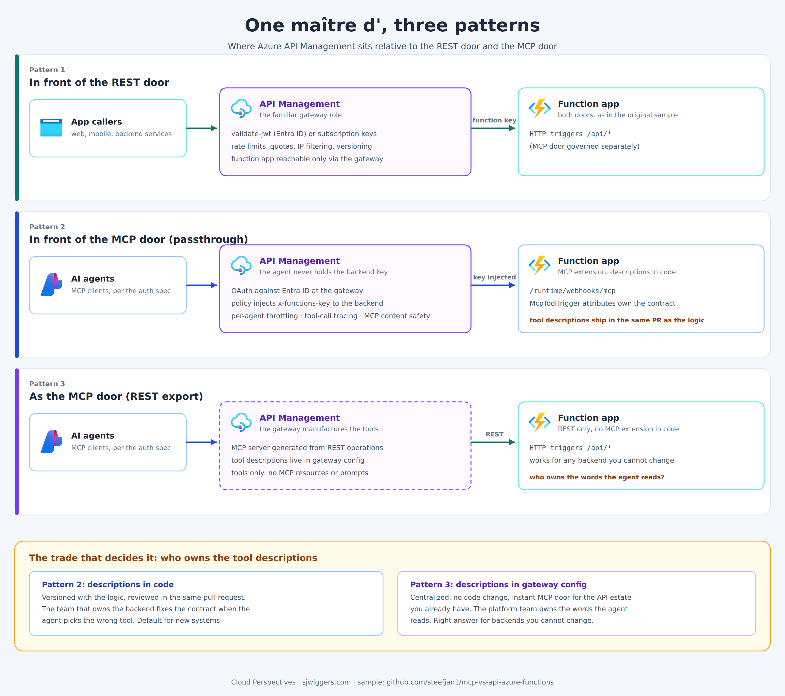

# APIM in front of the doors: three patterns

This module puts Azure API Management in front of the sample, demonstrating the three patterns from the follow-up post "Same Kitchen, Two Doors, One Maître d'":

| Pattern | What it is | Where tool descriptions live |
|---|---|---|
| 1 | APIM in front of the REST door | n/a (REST contract) |
| 2 | APIM as passthrough for the Functions MCP door | In the C# (`McpToolTrigger` attributes) |
| 3 | APIM as the MCP door, generated from the REST operations | In `main.bicep`, at the gateway |



## Deploy

Deploy the base sample first (`azd up` from the repo root), then add APIM into the same resource group:

```
az deployment group create -g <resource-group> -f infra/apim/main.bicep -p functionAppName=<function-app-name> -p publisherEmail=<you@example.com> -p mcpExtensionKey=<key>
```

where the key comes from:

```
az functionapp keys list -g <resource-group> -n <function-app-name> --query systemKeys.mcp_extension -o tsv
```

The deployment uses the Basic v2 tier, which provisions in minutes rather than the better part of an hour. It is not free; run `az deployment group delete` or delete the APIM instance when done experimenting.

The outputs give you three gateway URLs, one per pattern.

## Try the patterns

Every call needs an APIM subscription key in the `Ocp-Apim-Subscription-Key` header. Get one from the portal (APIM > Subscriptions, the built-in all-access subscription works for testing) or:

```
az rest --method post --url "https://management.azure.com/subscriptions/<sub>/resourceGroups/<rg>/providers/Microsoft.ApiManagement/service/<apim-name>/subscriptions/master/listSecrets?api-version=2024-06-01-preview" --query primaryKey -o tsv
```

**Pattern 1** (REST behind the gateway):

```
curl "https://<apim-name>.azure-api.net/restaurant/restaurants?cuisine=Italian" -H "Ocp-Apim-Subscription-Key: <key>"
```

Note the rate limit: more than 30 calls in 60 seconds returns 429.

**Pattern 2** (MCP passthrough): point an MCP client at

```
https://<apim-name>.azure-api.net/restaurant-mcp/mcp
```

with the `Ocp-Apim-Subscription-Key` header. The gateway injects the function app's `mcp_extension` key toward the backend; the client never holds it. The tools and their descriptions are the ones from the C# code.

**Pattern 3** (MCP generated from REST): point an MCP client at

```
https://<apim-name>.azure-api.net/restaurant-mcp-generated/mcp
```

Same three tools, but this server has no MCP extension behind it; the gateway manufactures the tools from the REST operations, and the descriptions come from `main.bicep`. Compare `tools/list` between patterns 2 and 3 to see whose words the agent reads in each.

## Caveats

- Subscription keys stand in for real client identity here. For end-user MCP clients that follow the MCP authorization spec, configure OAuth with Entra ID at the gateway; see the [APIM MCP server docs](https://learn.microsoft.com/azure/api-management/mcp-server-overview).
- APIM's MCP support is tools-only: no MCP resources or prompts. The Functions extension supports both, which is one reason pattern 2 remains the default for new systems.
- With APIM in place, the function app's endpoints should be restricted so only the gateway reaches them (IP restrictions or, on higher tiers, VNet integration). The demo leaves them open so the base sample keeps working standalone.
